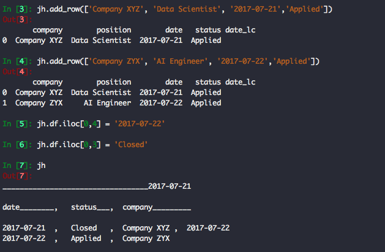
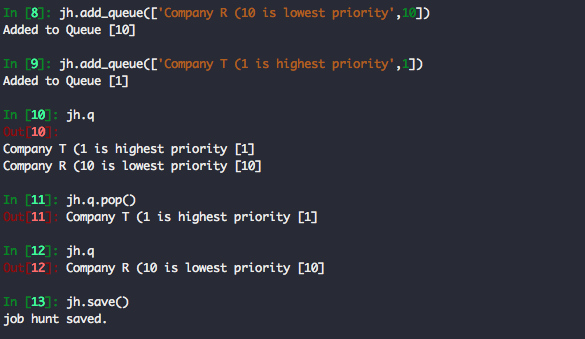

# command_line_job_hunt
### Keep track of your job applications like a data scientist

What's the difference between a Data Analyst and a Data Scientist?
> Data Scientist don't use excel.


Start your professional job hunt from the command line!
A Pandas DataFrame keeps track of your application progress
and a PriorityQueue keeps you focused on the most important task next.

___


###Getting Started


From the command line:
> ```python -i job_hunt_class.py "init"```  - the first time you run it.
>> ```python -i job_hunt_class.py```  - everytime after that.

From ipython:
> ```run job_hunt_class.py "init"```  - the first time you run it.
>> ```run job_hunt_class.py```  - everytime after that.


    This creates the job_hunt object jh
***Remember to jh.save() before exiting your interactive environment***

###Everything Else You Need to Know



    Customize to suit you.  It's a Pandas DataFrame and you ARE a Data Scientist!
